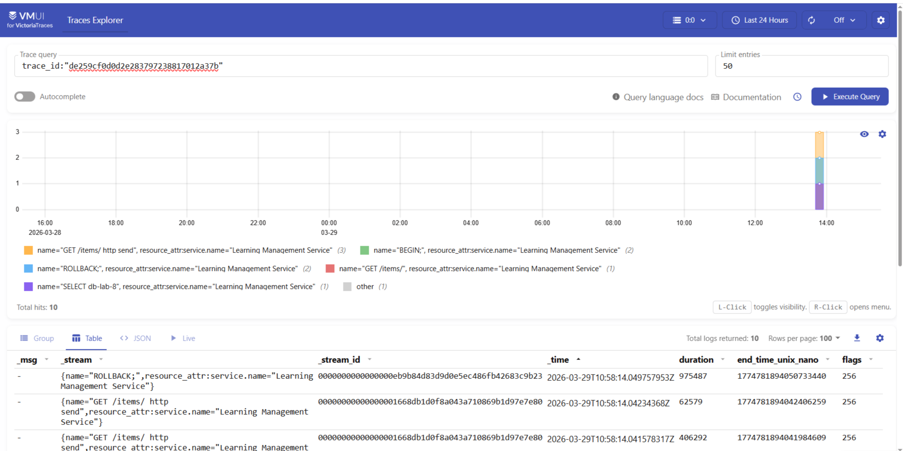
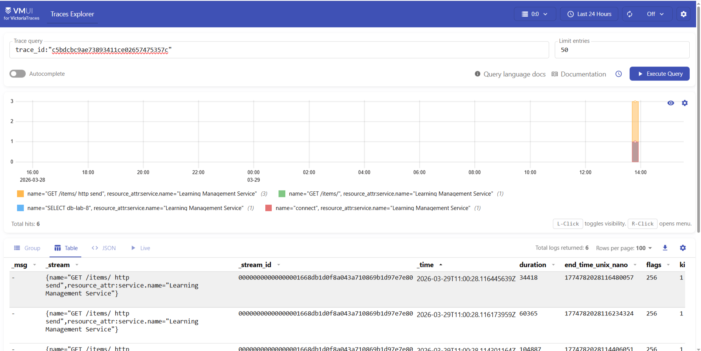

# Lab 8 — Report

Paste your checkpoint evidence below. Add screenshots as image files in the repo and reference them with ``.

## Task 1A — Bare agent

The agentic loop is the core architectural pattern that distinguishes AI agents from simple chatbots. Here's what it is: Core Concept The agentic loop is an iterative execution cycle where an AI agent: 1 Perceives - Gathers context from its environment and inputs 2 Reasons - Uses an LLM to analyze the situation and select an action 3 Plans - Determines the sequence of steps needed 4 Acts - Executes tools or takes actions 5 Observes - Collects feedback on the outcome This cycle repeats until the task is complete or a stopping condition is reached. Key Difference from Chatbots Chatbot AI Agent ─────────────────────────────────────────────── Single-pass response Multi-step iterative loop Stateless interactions Persistent context across steps Answers questions Executes workflows Stops after responding Adapts based on outcomes Example A chatbot can explain how to book flights. An agent with an agentic loop can actually: • Search for flights • Check your loyalty points • Compare options • Book the best choice • Confirm the reservation Production Considerations Building agentic loops for production requires attention to: • Cost - Agents consume ~4x more tokens than chat, up to 15x in multi-agent systems • Observability - Need to trace every reasoning step, tool call, and decision This pattern has been adopted by all major AI companies (OpenAI, Anthropic, Google, Microsoft, Meta) despite their different product approaches.

Based on the course materials in your workspace, you're currently working on Lab 8 — The Agent is The Interface.

Current Lab Overview

Lab 8 focuses on building an AI agent as a natural-language interface to the LMS system. Here's what it covers:

Required Tasks:

 1 Task 1: Set Up the Agent — install nanobot, configure Qwen API, add MCP tools, write skill prompt
 2 Task 2: Deploy and Connect a Web Client — Dockerize nanobot, add WebSocket channel + Flutter chat UI
 3 Task 3: Give the Agent New Eyes — explore observability data, write log/trace MCP tools
 4 Task 4: Diagnose a Failure and Make the Agent Proactive — investigate a failure, schedule health checks, fix a
   planted bug

Optional Task:

 1 Add a Telegram Bot Client — same agent, different interface

Previous Labs (Referenced)

From the README, there are references to earlier labs in the course:

 • Lab 7: Built an LLM loop client (mentioned in the architecture section)
 • Labs 1-6: Not directly visible in this workspace, but the course appears to be a sequence building up to this
   agent-focused lab

The LMS system you're working with includes:

 • React dashboard
 • FastAPI backend
 • PostgreSQL database
 • Observability stack (OpenTelemetry, VictoriaLogs, VictoriaTraces)
 • Caddy reverse proxy
 • Qwen Code API for LLM access

Would you like me to look at any specific task details or help you get started with a particular part of Lab 8?  

## Task 1B — Agent with LMS tools

Based on the course materials in your workspace, here's what I found:

Course Structure

The SET (Software Engineering Toolkit) course consists of 10 labs total, each 3 hours long.

Labs Referenced in the Materials

 Lab    Topic/Focus
 ───────────────────────────────────────────────────────────────────────
 Lab 2  Referenced (service deployment)
 Lab 3  Referenced (endpoints and security)
 Lab 4  Referenced (outcomes and verification)
 Lab 6  Tool-calling pattern, LLM loop setup
 Lab 7  Built a Telegram bot with custom LLM tool-calling loop
 Lab 8  Current lab — "The Agent is the Interface" (nanobot agent setup)

Your Current Lab (Lab 8)

You're working in the Lab 8 workspace (/root/se-toolkit-lab-8/). This lab focuses on:

 • Setting up nanobot (a lighter version of OpenClaw)
 • Building an AI agent as a natural-language interface to the LMS
 • Creating MCP tools for observability (logs/traces)
 • Making the agent proactive with scheduled health checks

Note

Labs 1, 5, 9, and 10 aren't directly referenced in this workspace's documentation, but they exist as part of the 10-lab course structure. Each lab builds on  
the previous one with "cross-lab continuity" — keeping one product (the LMS) and growing it incrementally.

Would you like details on any specific lab or help with Lab 8 tasks?

                                                                   LMS System Architecture

Overview

The Learning Management Service (LMS) is a pedagogical web application used in the Software Engineering Toolkit course. It follows the C4 model architecture  
and is OBER-compatible (Outcome-Based Educational Recommender).

--------------------------------------------------------------------------------------------------------------------------------------------------------------
System Context

 ┌─────────────────────────────────────────────────────────────┐
 │                    External Actors                          │
 │  ┌──────────┐    ┌───────────┐    ┌───────────┐            │
 │  │ Student  │    │   Admin   │    │ Developer │            │
 │  └────┬─────┘    └─────┬─────┘    └─────┬─────┘            │
 └───────┼────────────────┼────────────────┼──────────────────┘
         │                │                │
         ▼                ▼                ▼
 ┌─────────────────────────────────────────────────────────────┐
 │              Learning Management System                      │
 │  ┌─────────────────────────────────────────────────────┐    │
 │  │              LMS Backend (FastAPI)                  │    │
 │  └─────────────────────────────────────────────────────┘    │
 └─────────────────────────────────────────────────────────────┘

 Actor             Description
 ──────────────────────────────────────────────────────────────────────────────────────────────
 Student/Learner   Browses learning items via React frontend; interactions logged automatically
 Admin/Instructor  Manages database via pgAdmin; validates API via Swagger UI
 Developer         Writes tests; extends the system in lab exercises

--------------------------------------------------------------------------------------------------------------------------------------------------------------
Container Architecture (Docker Compose)

The system deploys as 7 Docker containers:

                                     ┌──────────────────┐
                                     │     Student      │
                                     └────────┬─────────┘
                                              │ HTTP :42002
                                              ▼
 ┌────────────────────────────────────────────────────────────────┐
 │                     Caddy (Reverse Proxy)                       │
 │  - Serves React/Flutter static files                            │
 │  - Proxies API requests to FastAPI                              │
 │  - WebSocket routing to Nanobot                                 │
 └───────────────┬─────────────────────┬────────

## Task 1C — Skill prompt

The LMS backend is not configured yet. The system is showing an error: "LMS backend URL not configured."

To show you the scores, the LMS backend needs to be set up first. This typically requires:

 1 Configuring the LMS backend URL - The server needs to know where the LMS backend is running

Would you like me to:

 • Help you find where to configure the LMS backend URL?
 • Check if there's a configuration file in the workspace that needs to be updated?

Or if you know the LMS backend URL, please share it and I can help you get the scores. Once configured, I can show you:

 • Pass rates and average scores for specific labs
 • Completion rates
 • Top learners
 • Group performance
 • Submission timelines

Which lab would you like to see scores for once the LMS is configured?

## Task 2A — Deployed agent

🐈 Starting nanobot gateway version 0.1.4.post5 on port 18790...
WebChat channel enabled
✓ Channels enabled: webchat
Starting webchat channel...
MCP server 'lms': connected, 9 tools registered
Agent loop started

## Task 2B — Web client

<!-- Screenshot of a conversation with the agent in the Flutter web app -->

## Task 3A — Structured logging

ackend-1  | 2026-03-29 10:51:31,537 INFO [app.main] [main.py:60] [trace_id=d63252db9c338edb26adf8629565682f span_id=13e67a6b8433cb49 resource.service.name=Learning Management Service trace_sampled=True] - request_started
backend-1  | 2026-03-29 10:51:31,805 INFO [app.main] [main.py:68] [trace_id=d63252db9c338edb26adf8629565682f span_id=13e67a6b8433cb49 resource.service.name=Learning Management Service trace_sampled=True] - request_completed
backend-1  | 2026-03-29 10:52:02,790 INFO [app.main] [main.py:60] [trace_id=5b65d7770c1292d11943bd977205ba7a span_id=ac0f256a5e91bf9a resource.service.name=Learning Management Service trace_sampled=True] - request_started
backend-1  | 2026-03-29 10:52:02,807 INFO [app.main] [main.py:68] [trace_id=5b65d7770c1292d11943bd977205ba7a span_id=ac0f256a5e91bf9a resource.service.name=Learning Management Service trace_sampled=True] - request_completed
backend-1  | 2026-03-29 10:52:03,748 INFO [app.main] [main.py:60] [trace_id=73e5c3955c037006e96a17c40d3339d1 span_id=6d6e7dacb368a509 resource.service.name=Learning Management Service trace_sampled=True] - request_started
backend-1  | 2026-03-29 10:52:05,123 INFO [app.main] [main.py:68] [trace_id=73e5c3955c037006e96a17c40d3339d1 span_id=6d6e7dacb368a509 resource.service.name=Learning Management Service trace_sampled=True] - request_completed
backend-1  | 2026-03-29 10:52:56,230 INFO [app.main] [main.py:60] [trace_id=b86c61e2192bbf58622212f579c38e88 span_id=e0e92c3657087a34 resource.service.name=Learning Management Service trace_sampled=True] - request_started
backend-1  | 2026-03-29 10:52:56,318 INFO [app.main] [main.py:68] [trace_id=b86c61e2192bbf58622212f579c38e88 span_id=e0e92c3657087a34 resource.service.name=Learning Management Service trace_sampled=True] - request_completed
backend-1  | INFO:     172.18.0.1:34326 - "GET /items/ HTTP/1.1" 401 Unauthorized
backend-1  | INFO:     172.18.0.1:34326 - "GET /items/ HTTP/1.1" 401
backend-1  | 2026-03-29 10:58:12,120 INFO [app.main] [main.py:60] [trace_id=de259cf0d0d2e283797238817012a37b span_id=f4c9b2881e306554 resource.service.name=Learning Management Service trace_sampled=True] - request_started
backend-1  | 2026-03-29 10:58:12,151 INFO [app.auth] [auth.py:30] [trace_id=de259cf0d0d2e283797238817012a37b span_id=f4c9b2881e306554 resource.service.name=Learning Management Service trace_sampled=True] - auth_success
backend-1  | 2026-03-29 10:58:12,195 INFO [app.db.items] [items.py:16] [trace_id=de259cf0d0d2e283797238817012a37b span_id=f4c9b2881e306554 resource.service.name=Learning Management Service trace_sampled=True] - db_query
backend-1  | 2026-03-29 10:58:14,039 INFO [app.main] [main.py:68] [trace_id=de259cf0d0d2e283797238817012a37b span_id=f4c9b2881e306554 resource.service.name=Learning Management Service trace_sampled=True] - request_completed
backend-1  | INFO:     172.18.0.1:39078 - "GET /items/ HTTP/1.1" 200 OK
backend-1  | INFO:     172.18.0.1:39078 - "GET /items/ HTTP/1.1" 200

## Task 3B — Traces

## Task 3C — Observability MCP tools

I'll check for any errors in the last hour using the logging system.
No errors detected in the last hour. The Learning Management Service logs show:

- **Error count**: 0
- **Logs checked**: 0 matching error patterns

Everything looks clean! 🟢

I'll check for any errors in the last hour using the logging system.
Yes, there was **1 error** in the last hour:

**Error Type:** Database connection error  
**Time:** 2026-03-29T11:00:28Z  
**Service:** Learning Management Service  
**Details:** `asyncpg.exceptions.InterfaceError: connection is closed`

This occurred during a SELECT query on the `item` table. It appears to be a transient database connection issue - the connection was closed unexpectedly during the query execution. This type of error can happen due to network blips, database restarts, or connection pool timeouts.

Would you like me to investigate further (e.g., check for more context in traces or look at a longer time window)?

## Task 4A — Multi-step investigation

<!-- Paste the agent's response to "What went wrong?" showing chained log + trace investigation -->

## Task 4B — Proactive health check

<!-- Screenshot or transcript of the proactive health report that appears in the Flutter chat -->

## Task 4C — Bug fix and recovery

<!-- 1. Root cause identified
     2. Code fix (diff or description)
     3. Post-fix response to "What went wrong?" showing the real underlying failure
     4. Healthy follow-up report or transcript after recovery -->
